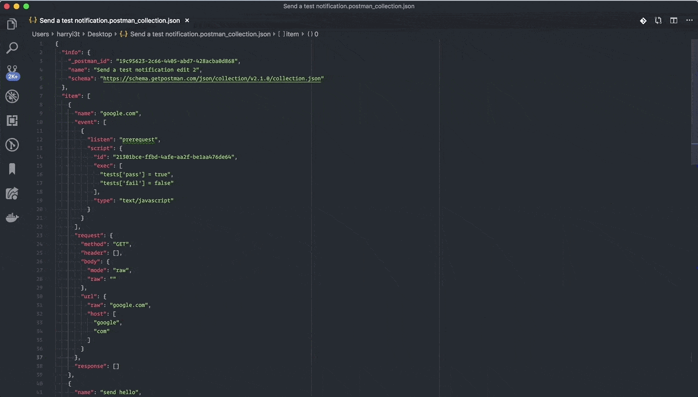

# vscode-newman

A POC level extension which runs a [Postman Collection](https://www.getpostman.com/collection) using [Newman](https://github.com/postmanlabs/newman) and displays the HTML report within VSCode.

